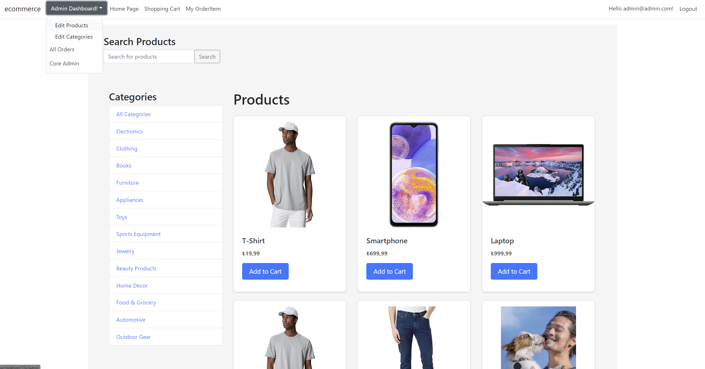
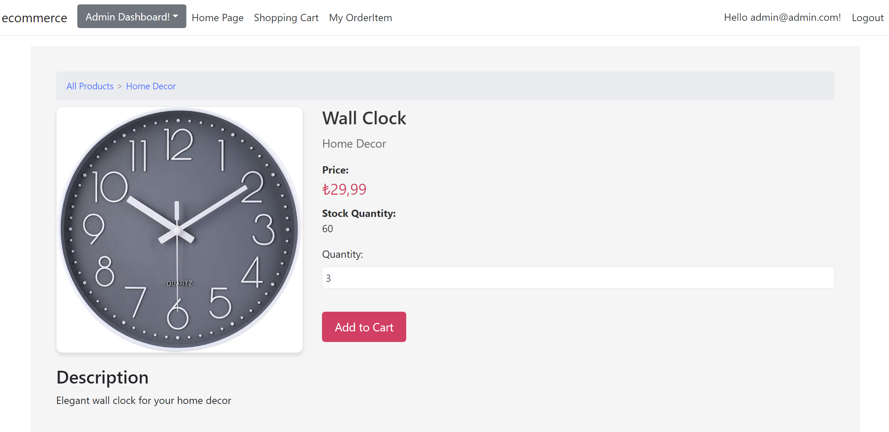
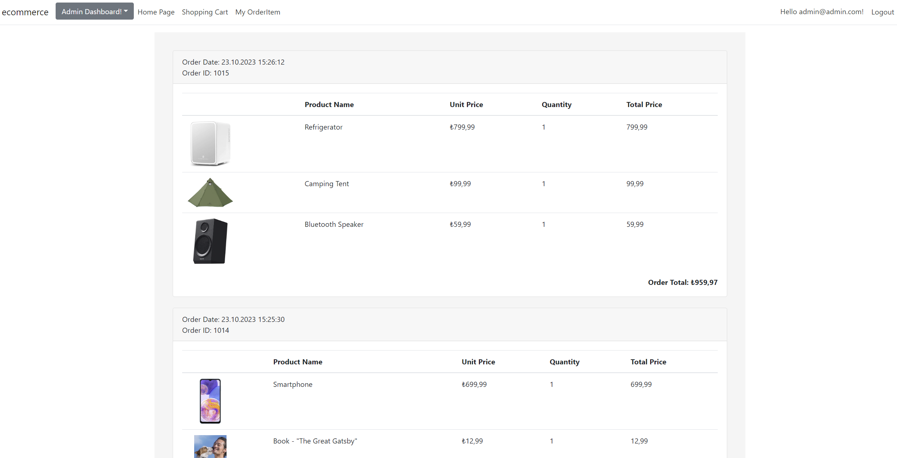
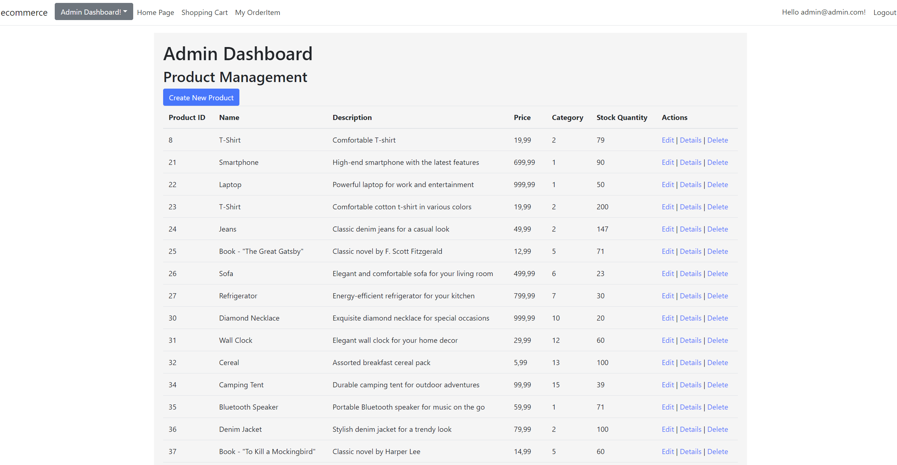

# E-Commerce Web Application

This is an E-Commerce web application built with ASP.NET Core MVC 6 and Entity Framework Core. It allows users to browse and purchase products, manage their shopping cart, and save multiple shipping addresses. Admin users have access to product and category management.

## Features

### User-Facing Features

- **Product Catalog:** Users can browse and view product details, including name, description, price, and category.

- **Shopping Cart:** Users can add products to their shopping cart, adjust quantities, and proceed to checkout.

- **User Authentication:** User accounts are protected by authentication. Users can register, log in, and reset their passwords.

- **Multiple Shipping Addresses:** Users can save and manage multiple shipping addresses for order delivery.

### Admin Features

- **Product Management:** Admin users can create, edit, and delete products. Each product includes a name, description, price, and category.

- **Category Management:** Admin users can create, edit, and delete product categories.

## Technology Stack

- **ASP.NET Core MVC 6:** Used for building the web application.

- **Entity Framework Core:** Used for database interactions and data modeling.

- **ASP.NET Core Identity:** Provides user authentication and management.

## Video (Click on it 😎)
> Pro Tip: Watching at 1.5x speed is recommended for a faster and more exciting experience! 🚀😄

## Entity Relationship (ER) Diagram

## Screenshots

## Getting Started

1. Clone this repository to your local machine.
2. Configure your database connection in the `appsettings.json` and files.
3. Run database migrations using the Entity Framework CLI or the Package Manager Console in Visual Studio:
4. Launch the application:
  
## Usage

- Visit the homepage to browse products.
- Register or log in to manage your shopping cart and shipping addresses.
- Admin users can access the admin dashboard to manage products and categories.

## Contributing

Contributions are welcome. If you'd like to improve this project, please fork the repository and create a pull request.

## License

This project is licensed under the [MIT License](LICENSE).

# ------------ TURKISH ------------
# E-Ticaret Web Uygulaması

Bu, ASP.NET Core MVC 6 ve Entity Framework Core ile oluşturulmuş bir E-Ticaret web uygulamasıdır. Kullanıcıların ürünlere göz atmasına ve satın almasına, alışveriş sepetlerini yönetmesine ve birden fazla gönderim adresi kaydetmesine olanak tanır. Yönetici kullanıcıların ürün ve kategori yönetimine erişimi vardır.

## Özellikler

### Kullanıcıya Yönelik Özellikler

- Ürün Kataloğu:** Kullanıcılar ad, açıklama, fiyat ve kategori dahil olmak üzere ürün ayrıntılarına göz atabilir ve bunları görüntüleyebilir.

- Alışveriş Sepeti:** Kullanıcılar alışveriş sepetlerine ürün ekleyebilir, miktarları ayarlayabilir ve ödeme işlemine geçebilir.

- Kullanıcı Kimlik Doğrulama:** Kullanıcı hesapları kimlik doğrulama ile korunur. Kullanıcılar kayıt olabilir, giriş yapabilir ve şifrelerini sıfırlayabilir.

- **Çoklu Gönderim Adresleri:** Kullanıcılar sipariş teslimatı için birden fazla gönderim adresi kaydedebilir ve yönetebilir.

### Yönetici Özellikleri

- Ürün Yönetimi:** Yönetici kullanıcılar ürün oluşturabilir, düzenleyebilir ve silebilir. Her ürün bir ad, açıklama, fiyat ve kategori içerir.

- Kategori Yönetimi:** Yönetici kullanıcılar ürün kategorileri oluşturabilir, düzenleyebilir ve silebilir.

## Teknoloji Yığını

- **ASP.NET Core MVC 6:** Web uygulamasını oluşturmak için kullanılır.

- **Entity Framework Core:** Veritabanı etkileşimleri ve veri modellemesi için kullanılır.

- **ASP.NET Core Identity:** Kullanıcı kimlik doğrulaması ve yönetimi sağlar.

## Video (Tıklayınız 😎)
> Profesyonel İpucu: Daha hızlı ve daha heyecan verici bir deneyim için 1,5x hızda izlemeniz önerilir! 🚀😄

## Varlık İlişkileri (ER) Diyagramı

## Başlarken

1. Bu depoyu yerel makinenize klonlayın.
2. Veritabanı bağlantınızı `appsettings.json` ve `appsettings.Development.json` dosyalarında yapılandırın.
3. Entity Framework CLI veya Visual Studio'daki Paket Yöneticisi Konsolu'nu kullanarak veritabanı geçişlerini çalıştırın:
4. Uygulamayı başlatın:

## Kullanım

- Ürünlere göz atmak için ana sayfayı ziyaret edin.
- Alışveriş sepetinizi ve gönderim adreslerinizi yönetmek için kaydolun veya oturum açın.
- Yönetici kullanıcılar, ürünleri ve kategorileri yönetmek için yönetici kontrol paneline erişebilir.

## Katkıda bulunmak

Katkılara açığız. Bu projeyi geliştirmek istiyorsanız, lütfen depoyu çatallayın ve bir çekme isteği oluşturun.

## Lisans

Bu proje [MIT Lisansı] (LICENSE) altında lisanslanmıştır.
